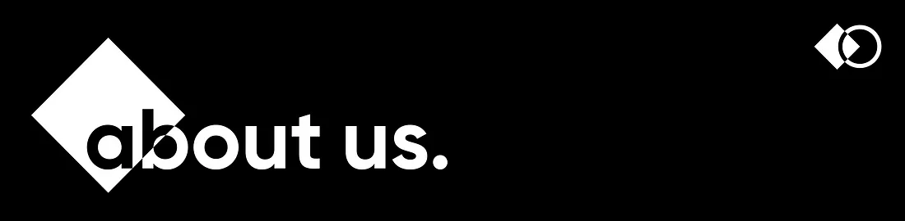
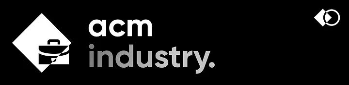
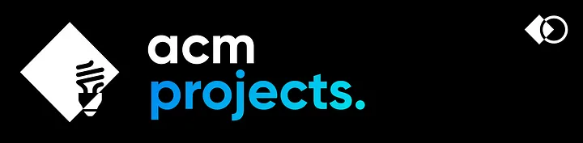
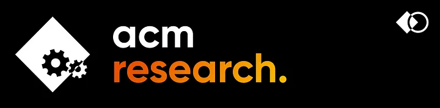
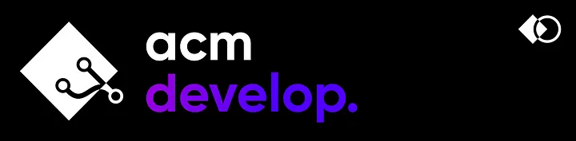
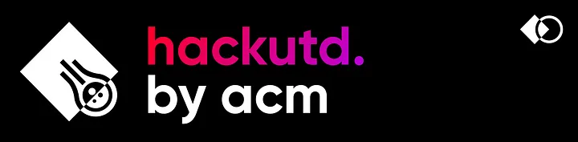

# About

# 

Association of Computing Machinery (ACM) is the **largest Computer Science student organization** at the University of Texas of Dallas (UTD). We’re a team of students with one goal — **a greater, more collaborative engineering community** at The University of Texas at Dallas. We have many divisions/teams with initiatives to help provide innovative solutions and resources for students to grow and flourish in the technical field.

ACM has seven divisions: ACM Industry, ACM Projects, ACM Research, ACM Education, ACM Development, ACM Media, ACM Community, and HackUTD.

ACM Industry hosts companies from the DFW metroplex and beyond to **give students an inside view into the industry**. As our very first division, industry events form the core of the ACM member experience. Check out the list of our current sponsors on [our website](https://www.acmutd.co/). ACM Industry events have been a great platform for students to **connect with industry professionals**, learn about various companies, and even **get internship/job offers**!

ACM Projects is ACM’s semester-long guided projects for those new to software development, teaching collaborative tools, new technologies, and core development principles. ACM Projects is for rising engineers who want to build something large scale while working with a team where they will be guided by mentors and industry professionals.

ACM Research is a new semester-long, research-based initiative for students who want to explore various subfields in computer science. You will be guided by a research lead and a UTD faculty advisor throughout the semester to successfully create a tangible research project.

ACM Education gives students valuable skills needed for the workforce. We run the Technical Interview Prep (TIP) Program to help students ace their technical and behavioral interviews, the Mentor Program which pairs underclassmen with upperclassmen students to start connections and pass on advice, and various technical workshops on relevant topics during the school year.

ACM Development provides students a platform to follow their passion in developing the next generation of software that powers our community to new heights. Using advanced cutting-edge new technology, we seek to deliver innovative solutions to simplify and accelerate student growth and engagement within ACM. ACM Development will host open session discussions about various technical topics along with guest speakers throughout the semester.

ACM Community is dedicated to fostering a vibrant community within ACM by hosting entertaining events outside of the realm of ECS. We moderate the ACM Discord server and work to provide opportunities for ACM members to further engage with us.

ACM Media is our newest creative team behind all the marketing and design responsibilities that encompass ACM at UTD. We are a team of designers and marketing specialists to help conduct marketing campaigns and help promote ACM in the UTD campus and beyond.

HackUTD is the official student hackathon of UT Dallas and the largest hackathon in North Texas. In one 24 hour sprint, students can attend workshops, network with sponsors, make projects to compete for prizes, meet other hackers from around the country, and of course, get lots of swag! To register and learn more about it, go to https://www.hackutd.co/

**Don’t forget to follow us** on our social media and **check out our website** to learn more about all of these initiatives:
- Website: https://www.acmutd.co/
- Instagram: https://www.instagram.com/acmutd/
- LinkedIn: https://www.acmutd.co/linkedin
- Mailing List: https://www.acmutd.co/mailing
- Youtube: https://content.acmutd.co/youtube
- Facebook: https://www.facebook.com/acmatutd