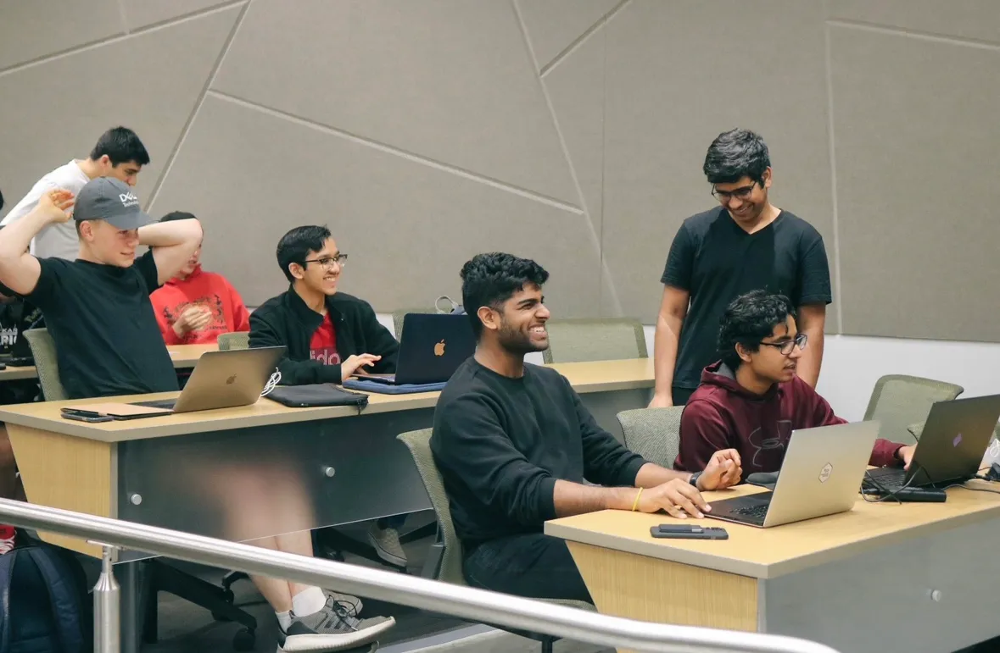

ACM Projects is ACM’s semester-long guided program for those new to software development, teaching collaborative tools, new technologies, and core development principles. The program is designed for freshmen and sophomores in any major who want to build a large scale software project with fellow students with the guidance of mentors and industry professionals. Although the project is large scale, there is little coding experience required! As part of ACM Projects, students will leave with better technical, teamwork and networking skills.

## The Application Process
Applying for ACM Projects is easy. Applications open at the beginning of every semester and to stay up to date with application openings and deadlines, join the [ACM Discord](https://acmutd.co/discord/) or follow ACM on [Instagram](https://www.instagram.com/acmutd/). If chosen, you’ll be interviewed by directors and project managers. Interviewers look for enthusiasm, initiative, and a spirit of collaboration in participants. While applicants are not expected to know all the answers, they are expected to be willing to work through them and learn something new. More information about interviews and the ACM application process can be found [here](/docs/getting-started/officer-application-process). After all applications have been reviewed and interviews have taken place, acceptance emails are sent out.

## The Structure of ACM Projects
If you are accepted into ACM Projects, first of all, congratulations! Teams consist of four to five participants, one project manager and one industry mentor. Between your teammates, half will be assigned to front-end development, while the other half will be assigned to back-end development. The team structure can be fluid however, and some will have full stack developers. Front-end developers will be in charge of the project’s outward design, and will work on components such as the graphical user interface, wireframes, user accessibility and UI/UX. Back-end developers will be working on the project’s functionality, such as the implementation of API calls, authentication, databases and servers. Participants drive the creation of their idea by coding and integrating all parts of software to create a final product.

The project manager and the industry mentor are there to guide students throughout the process of creating their project. Project Managers drive the progress and milestones of the project and ensure that participants are on track with project guidelines. They only guide, not code. Industry Mentors provide mentorship to their Project Manager and participants by advising the project at various intervals, as well as giving them an industry perspective on everything.

ACM Projects is ten weeks along. Throughout its entirety, there are three workshops, three socials, a presentation night and Build Nights that occur every other Wednesday. Teams meet outside of Build Nights to work on their projects as well.

## Build Nights
Lasting for about an hour and a half, Build Nights are a collaborative time for all of the teams to work on their projects together, as well as gain new relevant technological skills through workshops hosted by Project Managers. Towards the end of each Build Night, there are “End of Night” presentations, which allow teams to show off the work they have done so far, as well as discuss the obstacles they’ve come across.

## Projects Presentation Night
Projects Presentation Night is the night of nights for ACM Projects. It’s the opportunity where students can finally showcase the hard work they’ve been doing for the past few months. Teams take turns presenting their projects to a panel of industry judges and an audience made up of friends, family, mentors, and students. In the past, representatives from companies such as JPMorgan, State Farm, and Goldman Sachs have attended as industry judges.

After the presentations, 1st place, 2nd place, and a people’s choice award will be given with corresponding prizes. Regardless of whether or not a project wins a prize , it is the hard and soft skills gained from Projects that are the most important takeaways for participants. Often these will become great talking points on resumes and during interviews.

## Testimonials
Student testimonials are the best way to fully understand the essence and benefit of being in ACM Projects. Here are some below!

*Neha Thomas, front-end developer in "Factual"*
> "Our team project is called Factual and it’s basically a fact checking app. You can enter a claim such as ‘5g causes COVID’, and it will basically auto-populate a bunch of articles that relate to the claim that you’ve stated and then tell you whether it’s true or false. Whether the article that is being pulled up is biased or not. My part of the project is basically doing the front end, so I am taking care of the UI and how everything looks and also connecting it to the Google fact checking API."

*Keshav Santhanam, Full-stack developer in "IOU"
> "I think the most valuable thing I learned was understanding what to do when you run into an issue. If you work in a small team like this and you’re developing a product together, you all have to not just understand your own issues, but also other people’s issues. Sometimes that involves not just sitting there on your own and like looking up information, but also combining it with other other resources or even just other lines and ideas. For example, asking people what they want, what they believe, maybe a good compromise or a good workaround for a solution. You can by touching base, and really getting a good communication with your team members. It allows you to make the product a lot faster and fulfill the goals that you set up."

*Alex Dometrius, Industry Mentor*
> "I do as little as possible to the team. No, actually, I try not to stay involved in all the technical details, I feel like they learned the most. Even if there’s a problem, a technical problem or hurdle I could help solve, I try not to get involved. So I think it’s really more fun and interesting to watch them overcome those hurdles and grow. I usually help more the areas where they haven’t had some coaching before on presentations, maybe the speaking aspect and working with them on some overall ideas."

:::info
Want a deeper look at ACM Projects? Make sure to watch [previous ACM Projects Presentation Nights](https://www.youtube.com/@acmutdallas4256/featured) and explore the [ACM Projects Github](https://github.com/acm-projects)!
:::