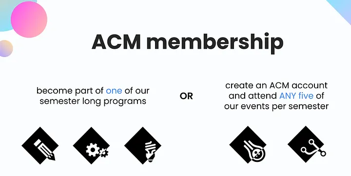

**Have you wondered how to become an ACM UTD member, or get involved with ACM UTD?**

Have you ever wondered how to get involved within ACM? Are you new to UT Dallas or returning to campus for the first time in over a year? Do you want to make friends, find an internship, or learn from talented peers and mentors? If you answered yes to any of those questions, this blog is for you!

In this blog, we will highlight how to meet and get involved with ACM students, how to find and attend workshops and industry events, and also some tips and tricks to make your time at UT Dallas a success.

## Becoming a Member

**What are the steps to become a member?** ACM memberships are 100% free. There are two ways to become a member, either event attendance or joining an ACM program. The first step is to register for an ACM account at https://portal.acmutd.co. Next, make sure to attend at least five events during the semester and check in to events to track your attendance in your account. After you’ve attended five events, congratulations, you are now an ACM member! The alternative route is to join a semester-long ACM program, either Projects, Research, TIP (Technical Interview Prep), or becoming a mentor or mentee in the ACM Mentor Program.

**Why should I make an account?** ACM uses this to track attendance at events when you check in to events through check-in links and also for officer applications. In addition, ACM industry sponsors want to recruit from our members, and we pass resumes on to them to help you find a job, internship, or other opportunity through ACM Member Portal.

## Other ways to get involved with ACM UTD
Even if you are not a member, or are looking for a more casual way to get involved with ACM, we have lots of opportunities for you to do so!

**Coding Hangouts:** We have coding hangouts every Tuesday evening for you to stop by and get some work done. Even if you don’t have any coding work or schoolwork at all to do, drop in and say hi, there’s always a new friend to be made!

**Industry events:** Industry events are another way that ACM can help you develop your skills. These events occur every week, at different times so be sure to check your email. Typically, these events are also streamed virtually. One key benefit of attending these events, beyond developing your skills, is meeting companies and their representatives in a laid-back setting. Students in the past have gotten internship offers just by attending the Industry Events! For many students, these events have helped them broaden their network and even find jobs!

**Educational Workshops:** Workshops are very helpful to students as they provide a way to gain programming knowledge, learn about new CS topics, and get to do hands-on coding as well! In the past, Education has also done workshop series, namely Game Development Workshop Series (Summer 2021), and CS Essentials workshop series (Fall 2021). Companies such as NVIDIA, Postman have also hosted workshops in the past for students to get valuable information about their technology, and for them to answer any questions!

**What about Discord?** ACM Discord is one of the best ways to find study groups, meet people with common interests, and ask questions. The Discord is divided into “Circles” which represent interest groups such as travel, K-Pop, eSports, french, anime, and cars. Some of the most popular circles are for internship hunting and preparation where many ACM members encourage and support each other in their job search process. There are also channels for general chat and also school-related questions. Events are frequently posted into the announcements channel on Discord, so check often to make sure you don’t miss out!