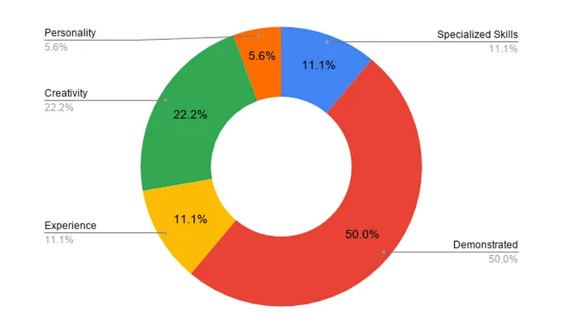
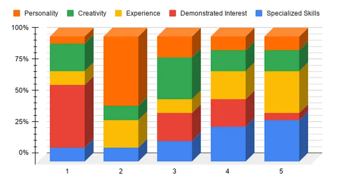
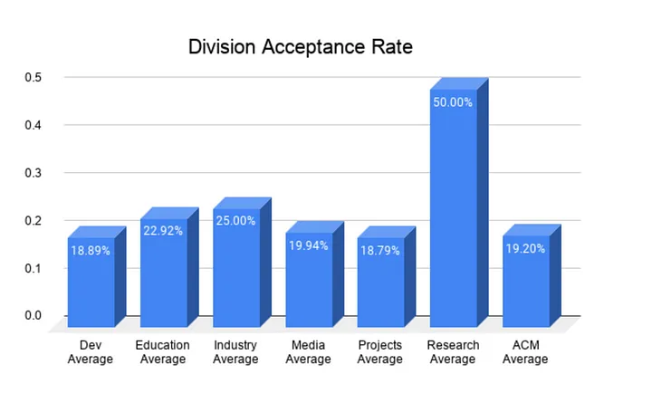

Have you ever wondered how to get involved as an ACM Officer or a participant?

This guide will help you learn more about ACM, the officer application process, and how to stand out.

## Applications
ACM Applications are usually open for officers, directors, or participants. As of April 2021, ACM has 3 divisions that have participant applications: ACM Projects, ACM Research, and ACM Education’s TIP (Technical Interview Prep) Program.

Officer positions are available for the following divisions: ACM Industry, ACM Education, ACM Development, ACM Projects, ACM Research, ACM Media, and HackUTD.

Learn more about our divisions, and what we do [here](https://www.acmutd.co/about)!

It is not guaranteed that all of these applications will open during a certain semester or period of time. Applications open based on open spaces for each division.

However, participant apps for ACM Projects, ACM Research, and TIP Program open every semester.

## Application Process
Now that you know about our applications, let’s discuss the application process!

Applying to become an ACM officer typically opens up around August, and December/January, which are the first months of the Fall, and Spring semesters.

There are usually three steps to the application process: **application, interview, and decision**. However, ACM Research has an additional step of solving a coding challenge before the interview for their participant applications.

Most division applications request a current resume and also any portfolio work you may have done that might be relevant to the position. For example, it might be helpful to put your graphic design works when applying to ACM Media (design) or show any technical projects you have worked on for ACM Development applications.

After filling out an application, applicants can expect to receive an email about whether they have been selected for an interview.

:::tip
Be sure to put as much information as you can, relevant to the position, in your application! It helps us get a better understanding of you as an applicant.
:::

## Interviewing
Woohoo! You have moved on to the interview process. During your interview, you can talk about your skills, previous experience, portfolio work, etc.

But, if you do not have any portfolio work or previous experience, don’t fret. In a survey of ACM Directors who interviewed applicants for Spring 2021 positions, over 50% said that **demonstrating an interest** in ACM is the most important aspect of the interview process. Another 20% reported that they felt **creativity** is most important. Interestingly, the majority of respondents said that **personality** is the second most important trait.

What does this mean for you? **It means that regardless of your major or years of college or work experience, you should feel confident in applying to ACM as an officer**. There is one caveat, ACM Development does prefer applicants who have some specialized skills in programming and related areas.

###### Most Important Skill as reported by ACM Directors

###### Ranked Importance of Skill (from left to right)

In the above graph, the percentage weight of the blocks represents their popularity among the directors. The importance of the skill is ranked from left to right, left (1) being the most important, and right (5) being the least important.

It can be seen that "Demonstrated Interest" is the most important skill in the application process (from bar 1), and specialized skill is considered the least important skill (from bar 5).

:::note

ACM UTD’s application and interview process give applicants an equal opportunity to present themselves, and we try our best to have an equal and fair evaluation of the candidate. ACM also evaluates candidates based on their fit at ACM! ACM UTD does not, and will not participate in nepotism\*, favoritism, or an unjust application process. ACM UTD does not discriminate against candidates based on race, color, religion, gender identity, or disability.

Everyone is welcome to apply to ACM UTD applications! However, Undergraduates will be given more priority over graduate students since ACM programs are more geared towards undergraduate students.

\*Applications such as Technical Interview Prep (TIP), and Projects also implement blind application review where applicant’s name is taken out of the application for a fair assessment, and process.

:::

## Outcomes
ACM applications can seem like a competitive process since we get hundreds of applications each semester. On average, about 20% of interviewees received acceptances after the application process. But, this percentage can vary based on the number of applications a division receives, and the semester the applications are open.

:::info
 Some applications request applicants to choose one division to apply, one such case is ACM Projects and ACM Research. Participants have to choose whether they want to be considered for ACM Projects, or ACM Research. Based on the preferences of the candidates, the acceptance rate of a certain division might be higher or lower than normal!
 :::

Here is a graph of the officer acceptance rates per division for Spring 2021!

**No matter what the outcome of the process is, whether you get accepted or don’t get accepted this time to be an officer or a participant, know that you are equally amazing as before**. There are hundreds of applications we get every semester, but we cannot accept everyone even if we wanted to!

If you did not get accepted, feel free to apply to our other applications over the semester. **You can still be a part of ACM by attending ACM events, workshops, social hours, participating in the ACM mentor/mentee program, interacting on discord, registering for HackUTD, etc**. If you got accepted, Congratulations! Welcome to ACM! We hope you have a wonderful time here!